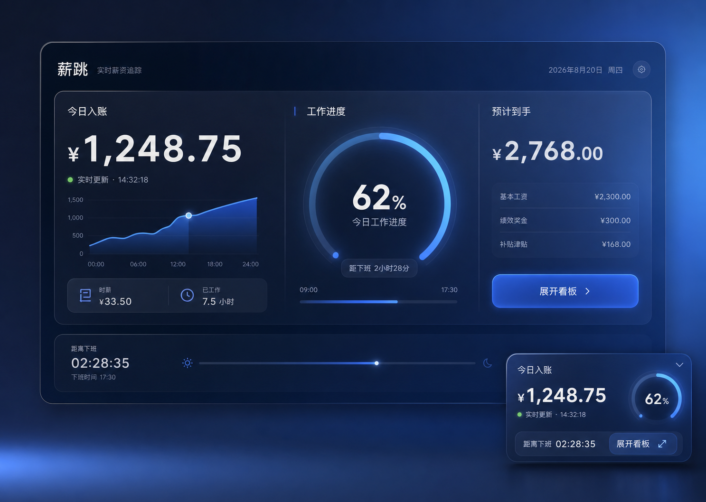
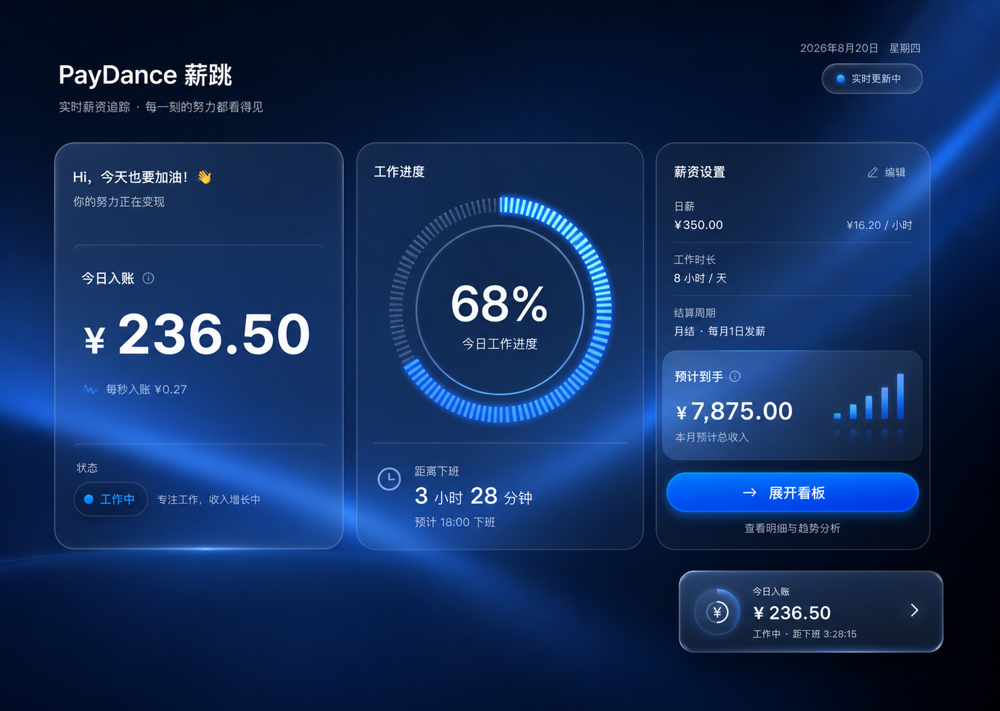
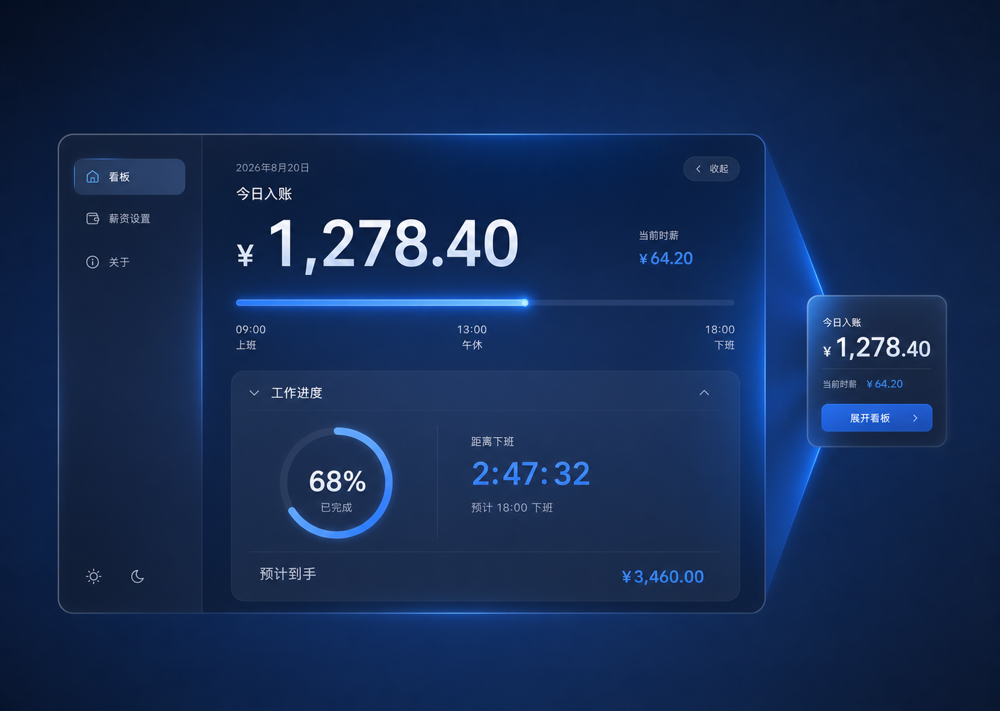

# shixin

一个用于构建“实时工资追踪器”的 Codex Skill。它参考 [PayDance](https://github.com/MrBaoboer/PayDance) 的产品功能，但使用独立的科技风蓝色毛玻璃界面，并扩展 macOS 菜单栏与 iOS 状态栏/Live Activity 设计。


## 设计预览

### 实时工资主看板

<p align="center">
  
</p>

### 科技风仪表盘

<p align="center">
  
</p>

### 紧凑快捷入口

<p align="center">
  
</p>

## 产品能力

- 月薪、日薪、时薪换算
- 工作日选择、上下班时间、跨零点夜班
- 午休扣除
- 上下班通勤时间计入工作时长
- 实时今日入账、工作进度、剩余时间、今日预计收入
- 本地优先保存，不要求账号或云端服务
- macOS 菜单栏只显示金额，点击打开完整看板
- iOS 顶部状态栏、安全区、Widget 和 Live Activity 风格的快捷查看设计

## 与 PayDance 的区别

| 项目 | PayDance 参考方向 | shixin 方向 |
| --- | --- | --- |
| 核心功能 | 实时工资追踪 | 保持相近的核心功能 |
| 视觉 | Windows 11 风格 | 科技风蓝色毛玻璃 |
| 桌面入口 | Windows 托盘/迷你悬浮窗 | macOS 菜单栏金额入口 |
| 移动入口 | 未作为核心表面 | 增加 iOS 状态栏、Widget/Live Activity 设计 |
| 实现边界 | Windows 桌面能力 | 当前优先 macOS + iOS 设计 |

## 使用

### 安装 Skill

将仓库目录复制到当前 Codex 的 Skills 目录：

```text
<CODEX_HOME>/skills/shixin
```

安装后重启或刷新 Codex 的 Skill 列表。

### 调用 Skill

```text
使用 $shixin 构建一个类似 PayDance 的实时工资追踪器，支持月薪、工作日、午休和通勤计算，界面使用科技风蓝色毛玻璃，并加入 macOS 菜单栏金额入口和 iOS 状态栏设计。
```

也可以分场景调用：

```text
使用 $shixin，只实现实时工资计算和工作日/午休/通勤设置，先不要接原生平台。

使用 $shixin，把这个实时工资看板做成 macOS 菜单栏应用，菜单栏只显示当前金额，点击打开完整看板。

使用 $shixin，为实时工资追踪器设计 iOS 顶部状态栏、Widget 和 Live Activity 三种快捷查看状态。
```

### 适用范围

- 需要从薪资和工作时间计算实时收入的个人工具
- 需要 macOS 菜单栏金额入口的桌面应用
- 需要 iOS 顶部栏、Widget 或 Live Activity 设计的产品
- 需要把功能规则、科技风 UI 和可验证交付放在同一套产品约束中的项目

## 设计与实现原则

- 金额、进度和剩余时间必须来自同一套薪资计算模型。
- 先做固定数据的视觉保真，再接入实时计时、持久化和原生桥接。
- iOS 设计要区分 App 内顶部栏、安全区、Widget 和 Live Activity；真正实现 Live Activity 时使用 ActivityKit 与 WidgetKit/SwiftUI。
- 不复制 PayDance 源码、商标、文案或页面结构，只参考公开的产品功能。

## 目录

```text
shixin/
├── SKILL.md
├── agents/openai.yaml
├── assets/screens/
│   ├── dashboard-overview.png
│   ├── paydance-style-dashboard.png
│   └── compact-dashboard.png
├── references/
│   ├── product-spec.md
│   ├── visual-system.md
│   ├── platform-surfaces.md
│   └── qa-release.md
└── README.md
```

## 安装

之后即可使用 `$shixin` 调用。作者归属和功能参考说明见 [CREDITS.md](CREDITS.md)。

## 作者与授权

`shixin` 由 [Banye0517](https://github.com/Banye0517) 创建和维护。功能方向参考 [MrBaoboer/PayDance](https://github.com/MrBaoboer/PayDance)，但本仓库不包含 PayDance 源码、商标或页面代码。

本仓库当前提供作者归属与来源说明，未擅自指定 MIT、Apache-2.0 等正式开源许可证；如需允许他人修改、再发布或商业使用，应先补充明确许可证。
